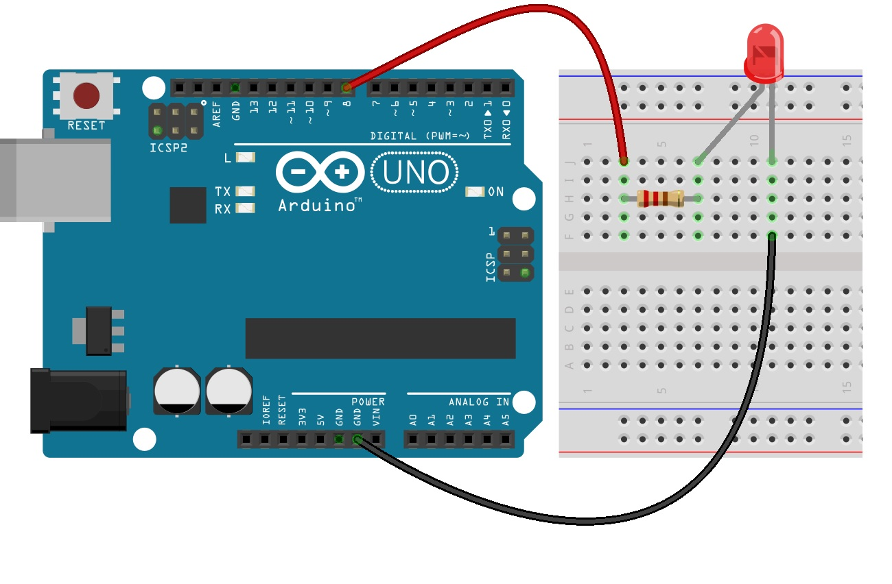
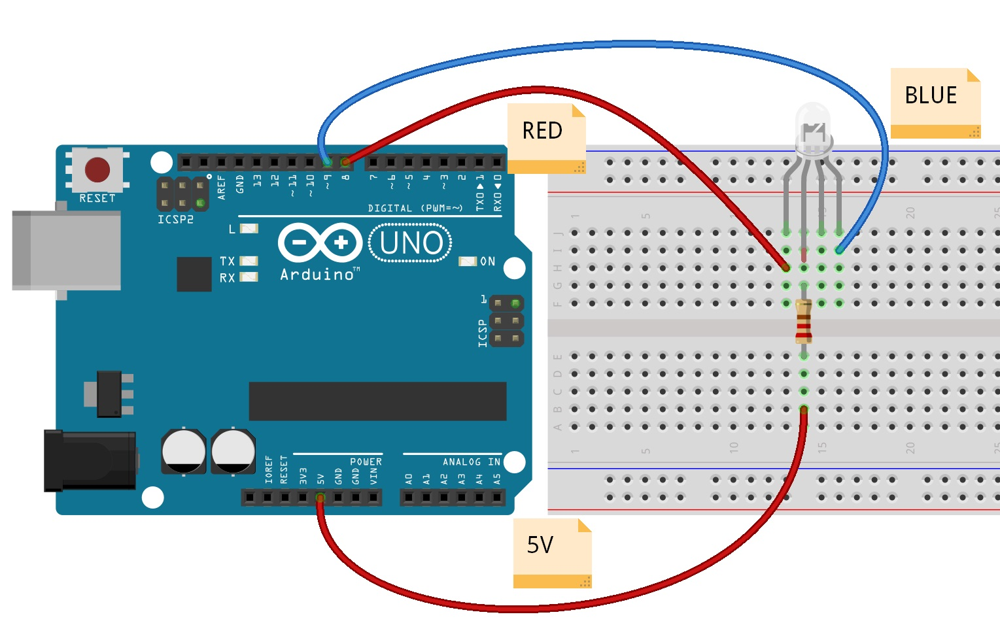

[<<<< Menu >>>>](../README.md)

# שיעור ראשון - הבהוב לדים - ערוץ דיגיטלי
&nbsp;&nbsp;
### המעגל שנבנה:
&nbsp;


<br><br>

### הקוד: 


```cpp

// The setup() function is run once, when the program starts.
void setup()
{
  pinMode(8, OUTPUT); // initialize digital pin 8 as an output.
}

// The loop function runs over and over again forever
void loop()
{
  digitalWrite(8, HIGH);   // turn the LED on (HIGH is the voltage level)
  delay(1000);             // wait for a second
  digitalWrite(8, LOW);    // turn the LED off by making the voltage LOW
  delay(1000);             // wait for a second
}
```

<br><br><br>
<br><br><br>
<br><br><br>


### מעגל נוסף - הבהוב ניידת משטרה:



