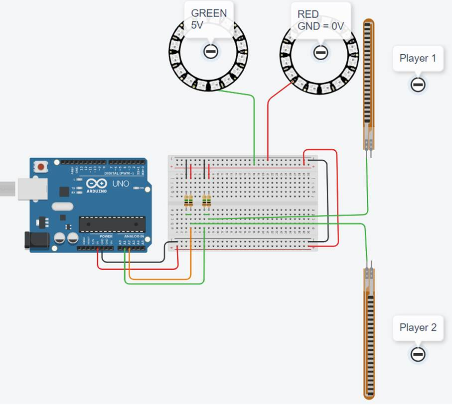
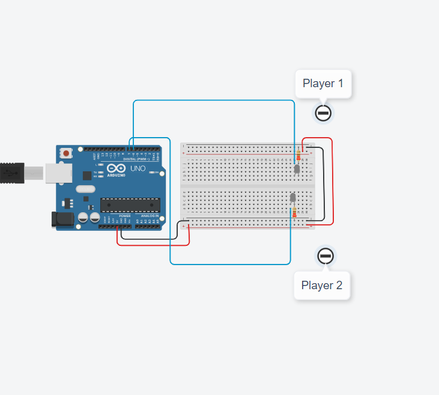

[<<<< Menu >>>>](../README.md)

# שיעור שני - פוטנציומטר - דגימה אנלוגית - ערוץ סריאלי
&nbsp;&nbsp;
### המעגל שנבנה:
&nbsp;


<br><br>

### פקודות שימושיות: 

```cpp


int AnalogPin = 0;
 
Serial.begin(9600);
 
int sensorValue = analogRead(AnalogPin); 
 
Serial.println(sensorValue); 

delay(10);   

 
```
<br><br><br><br><br><br><br><br><br><br><br><br>


### הקוד: 


```cpp

int AnalogPin = 0;
int DelayTime = 10; // 10 milliseconds

void setup() 
{
  Serial.begin(9600);     // init. serial com. at 9600 bits per sec.
}

void loop() 
{
  int sensorValue = analogRead(AnalogPin);   // read analog: 0 to 1023 (10 bits)
  
  Serial.println(sensorValue);   // print out the value you read
  delay(DelayTime);                
}

```

<br><br><br>
<br><br><br>
<br><br><br>


### צירוף הלד משעור קודם


<br><br><br><br><br><br>

# בניית המשחק

### מבנה המשחק:


### המעגל של המקלות והמשטחים:




### המעגל של הלדים - ירוק \ אדום:


### המעגל של הלדים - מי ניצח:




### המעגל המלא:


<br><br><br>

### הקוד:

```cpp

int Player_1_V = 0;
int Player_2_V = 0;

int Led_Color = 0;

int Stop = 0;

int GREEN = 1;  // Green connected to the GND = 0V
int RED = 2;    // Red connected to the 5V

int Someone_Won = 0;  // 0 - No one!

int LedPin_Color_Green = 8;
int LedPin_Color_Red = 9;

int LedPin_Player_1 = 6;
int LedPin_Player_2 = 7;

void setup() 
{
  randomSeed(analogRead(0) + analogRead(5));
  pinMode(LedPin_Color_Green, OUTPUT);
  pinMode(LedPin_Color_Red, OUTPUT);
  pinMode(LedPin_Player_1, OUTPUT);
  pinMode(LedPin_Player_2, OUTPUT);
  Serial.begin(9600);  // Begin the serial communication
}

void loop() 
{
  digitalWrite(LedPin_Color_Green, LOW);  // Turn off Green led
  digitalWrite(LedPin_Color_Red, LOW);    // Turn off Red led
  digitalWrite(LedPin_Player_1, LOW);     // Turn off Player 1 led
  digitalWrite(LedPin_Player_2, LOW);     // Turn off Player 2 led

  delay(2000);  // Pause  for 2 seconds

  Led_Color = random(1, 3);  // Choose a random number (1 or 2) represent Green / Red

  if (Led_Color == GREEN)  // Turn on the right color
  {
    Serial.println("Green LED on");
    digitalWrite(LedPin_Color_Green, HIGH);
  } 
  else 
  {
    Serial.println("Red LED on");
    digitalWrite(LedPin_Color_Red, HIGH);
  }

  Someone_Won = 0;  // 0 - No one!

  while (Someone_Won == 0)  // Wait for a player to touch a target
  {
    Player_1_V = analogRead(A1);
    Player_2_V = analogRead(A2);

    Serial.print("Player 1 V = ");
    Serial.print(Player_1_V);
    Serial.print("; \t Player 2 V = ");
    Serial.println(Player_2_V);

    // Testing Player 1 if he is hitting and if he is correct:
    if (Player_1_V < 400)  // Dose Player 1 touch the Green -> GND = 0V (< 512)
    {
      if (Led_Color == GREEN) 
      {
        Someone_Won = 1;
      } 
      else 
      {
        Someone_Won = 2;
      }
    }

    if (Player_1_V > 600)  // Dose Player 1 touch the Red -> 5V (> 512)
    {
      if (Led_Color == RED) 
      {
        Someone_Won = 1;
      } 
      else 
      {
        Someone_Won = 2;
      }
    }

    // Testing Player 2 if he is touching and if he is correct:

    if (Player_2_V < 400)  // Dose Player 2 touch the Green -> GND = 0V (< 512)
    {
      if (Led_Color == GREEN) 
      {
        Someone_Won = 2;
      } 
      else 
      {
        Someone_Won = 1;
      }
    }

    if (Player_2_V > 600)  // Dose Player 2 touch the Red -> 5V (> 512)
    {
      if (Led_Color == RED) 
      {
        Someone_Won = 2;
      } 
      else 
      {
        Someone_Won = 1;
      }
    }
  }

  if (Someone_Won == 1) 
  {
    Serial.println("********* Player ---- 1 ---- WON *********");
    digitalWrite(LedPin_Player_1, HIGH);
  }

  if (Someone_Won == 2) 
  {
    Serial.println("********* Player ---- 2 ---- WON *********");
    digitalWrite(LedPin_Player_2, HIGH);
  }

  delay(2000);  // Wait for 2000 millisecond(s)
}
```


